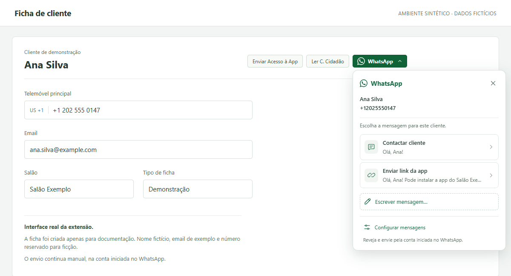

# Zappy WhatsApp Helper

Prepare personalized WhatsApp messages from a Zappy customer record, without copying the recipient and composing the same text each time.

**The extension prepares the conversation. You review and send in WhatsApp.**

[Português: instalação e utilização](docs/README.pt.md) · [Install](#install-and-use) · [Engineering details](docs/architecture.md)



*Actual extension UI on a synthetic customer record with fictitious data. The interface is in Portuguese.*

## Why it exists

Salon staff already work inside Zappy customer records. Moving to WhatsApp means finding the right number and preparing messages that often repeat the same instructions.

Built by [Rafael Lopes](https://github.com/Woddy23) for this Portuguese-speaking salon workflow, the extension adds message preparation to the existing record. It uses the primary phone number, fills reusable templates, and leaves the final action with the person contacting the customer.

## What it does

- Reads the current customer's name and primary phone number.
- Validates international numbers and uses the selected country for national numbers.
- Prepares reusable templates with customer name, salon name, and app-link variables.
- Supports one-off messages and optional PNGs copied for manual attachment.
- Saves configuration locally and blocks preparation when the recipient cannot be identified safely.

It does not send automatically, select the sender's WhatsApp account, or replace Zappy's native app-invitation action.

## How it works

A content script reads the visible customer record. A DOM adapter identifies the fields, phone validation normalizes the recipient, and the template engine prepares the message. The extension opens a WhatsApp conversation URL; the user reviews and sends there.

For image messages, the PNG is copied after a user click and pasted manually in WhatsApp. The image is not attached through the URL.

See [architecture and integration boundaries](docs/architecture.md).

## Engineering decisions

- **Reject ambiguous records.** Fields must be uniquely visible and share a customer container. The adapter refuses whole-document matching.
- **Recheck the recipient.** Changing the customer or phone number invalidates the draft. The recipient is checked again before opening WhatsApp and after asynchronous image copying.
- **Validate rather than guess.** Phone handling uses `libphonenumber-js`; an alternate number is never selected automatically.
- **Protect local edits.** Versioned configuration supports older settings. Saves use Web Locks and a baseline comparison to prevent stale settings tabs from silently overwriting newer changes.
- **Keep the integration narrow.** The extension has no WhatsApp content script and does not manipulate its Send button.

**Stack:** TypeScript · Manifest V3 · native browser APIs · libphonenumber-js · esbuild.

## Install and use

Manual installation in Chrome or Brave. The manifest requires Chromium 120 or later. No Node.js, server, API key, or additional account is needed to load the committed extension.

1. [Download the repository ZIP](https://github.com/Woddy23/Zappy-Whatsapp/archive/refs/heads/main.zip) and extract it into a permanent folder.
2. Open `chrome://extensions` or `brave://extensions` and enable **Developer mode**.
3. Choose **Load unpacked** and select the extracted repository's **`extension/`** folder—the folder containing `manifest.json`.
4. Refresh Zappy, then open the extension icon to configure messages.

The extension runs only on `https://zappysoftware.com/backoffice/*`.

To use it:

1. Open one customer record and click **WhatsApp ▾**.
2. Check the displayed name and number, then choose a template or **Escrever mensagem…**.
3. Review the prepared conversation in WhatsApp and send manually.

Text-only templates open WhatsApp directly. Image templates and one-off messages provide an editable field in the extension. For PNGs, use **Copiar imagem e abrir WhatsApp**, then paste with **Ctrl+V**.

The sender is the account signed into whichever WhatsApp application handles the link.

**Updates:** replace the extension files in the same installation folder, reload the extension, and refresh Zappy. Reloading alone does not download an update.

See the [Portuguese guide](docs/README.pt.md) for configuration, image limits, updates, and troubleshooting.

## Privacy and permissions

Customer details are read from the open record and held in memory for conversation preparation. The extension does not maintain a customer database, saved conversation drafts, or message history.

Templates, salon settings, app links, and PNGs are stored in `chrome.storage.local` in the browser profile. Personal information placed in saved templates or images is stored with them. This is local configuration storage, not a secure secrets vault.

| Access | Purpose |
|---|---|
| `storage` | Save configuration and optional PNGs locally |
| `clipboardWrite` | Copy a PNG after an explicit user action |
| Zappy backoffice content-script match | Read customer fields and display the helper |

**Both text and image workflows open a URL containing the recipient number and prepared message text.** That URL can appear in browser history. Image copying replaces clipboard contents; attachment remains manual.

The extension has no backend or telemetry code, does not request access to WhatsApp pages, and does not read cookies, credentials, or clipboard contents. Removing it clears its local configuration.

## Development and validation

TypeScript source lives in [`src/`](src/); committed browser-loadable files live in [`extension/`](extension/).

With Node.js 22.12+ in the Node 22 line, or Node 24:

```sh
npm ci --ignore-scripts
npm run check
npm run build
npm test
```

Regression tests exercise production phone, template, configuration, and customer-adapter modules. A separate installed-extension browser check validates the synthetic DOM contract, recipient-change protection, intercepted WhatsApp handoff, and real settings behavior. See [browser prerequisites](docs/development.md#browser-validation).

The screenshots above and in the user guide were captured with the actual installed extension in isolated Chromium. Recipient display, template expansion, options rendering, and an intercepted WhatsApp handoff were checked using synthetic data.

See [development and validation notes](docs/development.md) for command results, historical coverage, and live-environment boundaries.

## Limitations

- The adapter depends on Zappy's customer-record DOM. Host UI changes can require an adapter update.
- Missing, duplicated, loading, or invalid fields block preparation rather than selecting a guessed recipient.
- A valid phone number does not confirm a WhatsApp account.
- WhatsApp controls sender account and Web/Desktop routing. PNGs require manual attachment and do not automatically become message captions.
- Browser validation used synthetic pages. Live Zappy compatibility and final image paste in WhatsApp still need confirmation in the intended environment.
- Installation and updates are manual; no GitHub release package is currently published.

## Issues, status, and licence

Report reproducible problems through [GitHub Issues](https://github.com/Woddy23/Zappy-Whatsapp/issues). Include browser version and steps using fictitious data. Do not include customer details, cookies, authentication links, or unsanitized screenshots.

Version `0.1.0`. Independent integration; not affiliated with Zappy or WhatsApp.

No project-level licence is currently included. Public availability does not grant an open-source reuse licence. Third-party components retain their own licences; see [dependency licence files](extension/) and [asset attribution](docs/architecture.md#asset-attribution).
