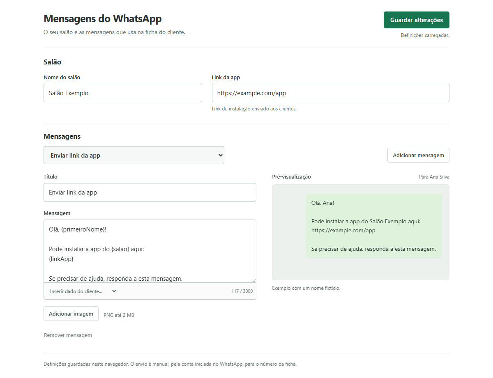

# WhatsApp na ficha Zappy

Prepare mensagens a partir do nome e telemóvel principal da ficha do cliente. **Reveja e envie no WhatsApp; a extensão nunca envia automaticamente.**

[Project overview (English)](../README.md) · [Instalar](#instalar) · [Configurar mensagens](#configurar-mensagens) · [Atualizar](#atualizar) · [Resolver problemas](#resolver-problemas)

*Interface real da extensão numa ficha criada para documentação. Nome fictício, email de exemplo e número reservado para ficção; não é uma captura do Zappy em produção.*

## Instalar

Requer Chrome ou Brave atualizado, baseado em Chromium 120 ou posterior. Instalação manual; não existe atualmente um pacote nas Releases nem instalação pela Chrome Web Store.

1. [Descarregue o ZIP do repositório](https://github.com/Woddy23/Zappy-Whatsapp/archive/refs/heads/main.zip).
2. Extraia o ZIP para uma pasta fixa no computador. Não carregue o ficheiro ZIP diretamente nem deixe a instalação numa pasta temporária.
3. Abra `chrome://extensions` ou `brave://extensions` e ative **Modo de programador**.
4. Clique em **Carregar sem compactação**.
5. Dentro da pasta extraída, selecione **`extension/`**, onde está `manifest.json`. Não selecione a raiz do repositório nem `src/`.
6. Confirme que a extensão aparece ativa e sem erros. A versão atual é `0.1.0`.
7. Atualize a página do Zappy. Clique no ícone da extensão para abrir as definições e configurar mensagens.

Não precisa de Node.js, servidor, chave de API ou conta adicional para instalar. Precisa de acesso ao Zappy e de uma conta WhatsApp para utilizar a conversa preparada.

A extensão só funciona em `https://zappysoftware.com/backoffice/*`, com uma única ficha identificável. A compatibilidade com a ficha real deve ser confirmada primeiro com dados fictícios ou autorizados; as capturas e verificações disponíveis usaram um ambiente sintético.

O botão nativo **Enviar Acesso à App** é um procedimento diferente do Zappy e pode enviar SMS. A extensão não o substitui nem clica nele.

## Usar na ficha

1. Abra uma ficha de cliente e clique em **WhatsApp ▾**. O botão aparece à direita de **Ler C. Cidadão**; se esse botão estiver ausente ou oculto, aparece junto de **Enviar Acesso à App**.
2. Confira o **nome e número internacional** mostrados no topo do painel.
3. Escolha uma mensagem ou **Escrever mensagem…**.
4. Reveja a conversa no WhatsApp, confirme a conta que envia e envie quando quiser.

| Opção | Comportamento |
|---|---|
| Mensagem sem imagem | Abre diretamente o WhatsApp com texto preparado; edite lá antes de enviar |
| **Escrever mensagem…** | Abre um campo para texto pontual; clique em **Abrir WhatsApp** quando estiver pronto |
| Mensagem com imagem | Abre texto editável e imagem; use [copiar e colar](#imagens) |
| **Configurar mensagens** | Abre as definições num separador; o ícone da extensão abre a mesma página |

Os modelos mostram título, excerto e ícone para distinguir texto, link e imagem. Um modelo com uma variável por configurar fica visível, mas indisponível, com explicação.

### Se mudar de cliente

Uma ficha em carregamento fica disponível quando os dados estabilizam. Se mudar de cliente ou de número com o painel aberto, o rascunho é limpo e a preparação fica bloqueada. Clique em **Atualizar destinatário**, confira os novos dados e escolha novamente. Alterações às definições também exigem atualizar as opções abertas.

O painel fecha ao clicar fora, clicar novamente no botão ou premir **Escape**. Os controlos têm suporte de teclado. Rascunhos pontuais não ficam guardados ao fechar o painel.

### Número do cliente e conta que envia

O telemóvel principal da ficha determina **quem recebe**. Números nacionais usam o país selecionado na ficha; indicativos explícitos como `+351` ou `00351` são respeitados. O número alternativo nunca é usado automaticamente. Um número válido não confirma que exista uma conta WhatsApp.

**Quem envia é a conta com sessão iniciada no WhatsApp Web ou na aplicação que abrir o link.** Confirme a conta do salão antes de enviar. A extensão não escolhe nem altera essa conta.

## Configurar mensagens

*Definições de demonstração: Salão Exemplo e `https://example.com/app`. A pré-visualização usa sempre o nome fictício Ana Silva.*

1. Abra **Configurar mensagens** ou clique no ícone da extensão.
2. Preencha **Nome do salão** e **Link da app** se os seus textos utilizarem esses dados.
3. Escolha uma mensagem no seletor e edite **Título** e **Mensagem**. O título aparece na ficha do cliente.
4. Use **Inserir dado do cliente…** para inserir uma variável na posição do cursor.
5. Opcionalmente, adicione um PNG e confira a pré-visualização.
6. Clique em **Guardar alterações** e confirme **Alterações guardadas.**

Mudar a mensagem selecionada preserva edições por guardar. A pré-visualização das definições é um exemplo, não uma conversa nem uma confirmação de envio.

### Variáveis e limites

| Variável | Valor utilizado |
|---|---|
| `{primeiroNome}` | Primeira palavra do nome do cliente |
| `{nome}` | Nome completo da ficha |
| `{salao}` | Nome do salão nas definições |
| `{linkApp}` | Link da app nas definições |

O link deve usar HTTPS e não incluir utilizador ou palavra-passe. Não guarde links pessoais de autenticação: estes dados fazem parte da configuração local e podem integrar mensagens enviadas a clientes.

| Campo | Limite |
|---|---|
| Mensagens guardadas | Entre 1 e 8 |
| Título | 60 caracteres |
| Texto do modelo | 3000 caracteres |
| Mensagem pontual ou texto editado na ficha | 4000 caracteres |
| Nome do salão | 100 caracteres |
| Link da app | 2000 caracteres |

### Guardar, remover e recuperar

- **Adicionar mensagem** cria um novo modelo. O novo título e texto precisam de ser preenchidos antes de guardar.
- **Remover mensagem** permite **Desfazer** a última remoção enquanto a página permanecer aberta. A remoção torna-se persistente ao guardar; mudar de modelo não recupera mensagens removidas.
- Sair com alterações por guardar apresenta aviso.
- Se outra página guardar primeiro, o editor bloqueia a substituição silenciosa. Recarregar descarta as edições locais depois de confirmação.
- Uma gravação inválida ou falhada não substitui as definições anteriores. Uma imagem de substituição inválida mantém a anterior.
- **Repor mensagens iniciais**, disponível na recuperação de erro de leitura, exige confirmação. A substituição só é persistida ao guardar.

Configurações antigas são lidas em memória e convertidas para o formato atual; a conversão só é gravada ao guardar. Detalhes técnicos estão na [arquitetura](architecture.md#local-configuration).

## Imagens

Cada mensagem pode ter um PNG diferente ou nenhuma imagem. Máximo de **2 MB** e **4096 × 4096 píxeis** no carregamento. Imagens iguais partilham armazenamento; a configuração completa tem limite de **9 MB**, incluindo os PNGs codificados. Reduza ou remova imagens se ultrapassar esse limite.

1. Na ficha, escolha uma mensagem com imagem e reveja o texto.
2. Clique em **Copiar imagem e abrir WhatsApp**. A extensão copia o PNG e abre a conversa com o texto preparado.
3. Cole a imagem com **Ctrl+V**, antes ou depois de enviar o texto.
4. Confira a imagem, o texto, o destinatário e a conta WhatsApp antes de enviar.

A cópia substitui o conteúdo da área de transferência. A extensão não controla o editor do WhatsApp: o texto não é automaticamente convertido em legenda da imagem.

Se a cópia falhar, tente novamente. Como alternativa, use **Guardar imagem**, anexe o PNG manualmente e prepare o texto com uma mensagem pontual. A compatibilidade da colagem final no WhatsApp real ainda precisa de confirmação.

## Atualizar

Recarregar a extensão não descarrega ficheiros novos. Para atualizar mantendo a instalação existente:

1. Descarregue e extraia o ZIP atualizado.
2. Feche rascunhos e páginas de definições com alterações por guardar.
3. Copie o conteúdo da nova pasta `extension/` para a **mesma pasta `extension/` que carregou ao instalar**.
4. Abra `chrome://extensions` ou `brave://extensions` e clique em **Recarregar** no cartão da extensão.
5. Atualize também as páginas do Zappy abertas.
6. Abra as definições e confirme os modelos antes de preparar uma conversa de teste.

Não remova a extensão para atualizar: a remoção apaga a configuração local. Não mude a instalação para outra pasta se quiser preservar a mesma instalação e definições. Modelos e imagens não são sincronizados entre computadores ou perfis do navegador.

## Resolver problemas

| Problema | O que verificar |
|---|---|
| Botão ausente | Extensão ativa, URL compatível, uma única ficha visível; recarregue extensão e página |
| Número inválido | Corrija o telemóvel principal e o país na ficha; use indicativo internacional quando necessário |
| **A ficha mudou** | Clique em **Atualizar destinatário**, confira os dados e escolha novamente |
| **Não foi possível identificar a janela** | A estrutura da ficha não corresponde ao leitor; forneça apenas HTML anonimizado para análise |
| Mensagem indisponível | Configure o salão/link indicado ou remova a variável em falta |
| Caráter inválido **�** | Reescreva o caráter nas definições; texto personalizado corrompido não pode ser recuperado automaticamente |
| WhatsApp não abre | Confirme WhatsApp disponível e permita novas janelas para Zappy; reveja possíveis separadores já abertos |
| Cópia de imagem falha | Tente novamente ou use **Guardar imagem** e anexe manualmente |
| Definições não abrem | Use ícone da extensão ou opções na página de extensões do navegador |
| Erro ao ler definições | Use **Recarregar definições**; reponha modelos apenas se aceitar a substituição ao guardar |
| Definições alteradas noutra página | Preserve o texto de que precisa antes de confirmar descarte e recarregar |

Uma mensagem de erro antiga pode mencionar **Abrir conversa sem copiar**, mas esse botão não existe na interface atual. Use **Guardar imagem** e uma mensagem pontual como alternativa.

Acentos e emojis válidos são suportados. O caráter de substituição **�** e sequências Unicode inválidas bloqueiam a preparação; não são eliminados nem adivinhados em textos personalizados.

Reporte problemas em [GitHub Issues](https://github.com/Woddy23/Zappy-Whatsapp/issues), com versão do navegador e passos para reproduzir usando dados fictícios. Não inclua dados de clientes, cookies, credenciais, links de autenticação ou capturas sem anonimização.

## Privacidade e limites

- A extensão lê o nome e telemóvel da ficha aberta; não cria uma base de clientes nem guarda rascunhos ou histórico de mensagens.
- Modelos, nome do salão, link da app e imagens ficam neste perfil do navegador. Dados pessoais escritos num modelo ou incluídos numa imagem ficam guardados com a configuração.
- Tanto mensagens com imagem como sem imagem abrem um link WhatsApp com **número e texto**. Esse link pode aparecer no histórico do navegador.
- O PNG fica na área de transferência até ser substituído; só é anexado ao WhatsApp quando o utilizador o cola ou anexa.
- As permissões são armazenamento local, escrita na área de transferência e execução no backoffice indicado. A extensão não lê cookies, credenciais ou área de transferência, nem tem código de servidor ou telemetria.
- As verificações disponíveis usaram páginas sintéticas, não uma sessão real do Zappy ou uma conversa autenticada do WhatsApp. Mudanças na interface do Zappy podem exigir atualização do leitor.

Versão `0.1.0`. Integração independente, sem afiliação ao Zappy ou WhatsApp. Não existe uma licença de código aberto para o projeto; consulte [estado e licença](../README.md#issues-status-and-licence).
