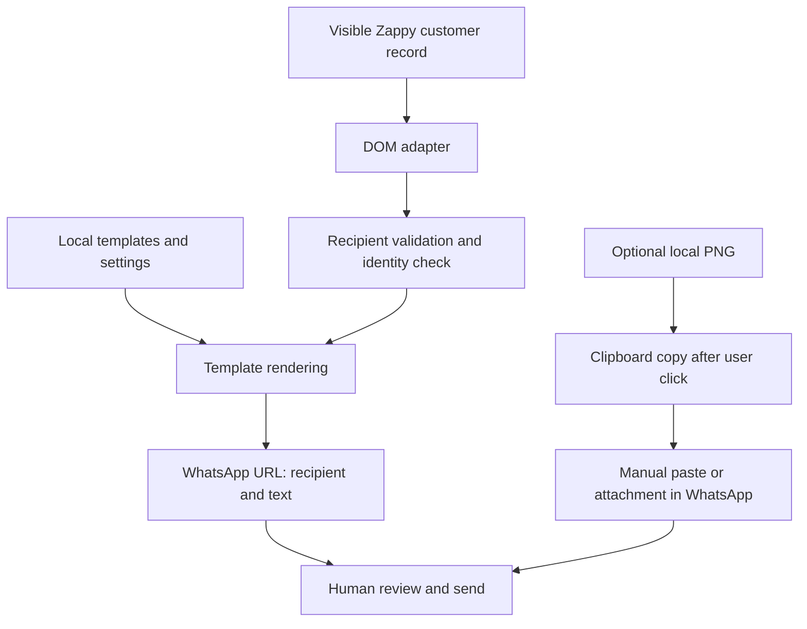

# Architecture and integration boundaries

[Project overview](../README.md) · [Portuguese user guide](README.pt.md) · [Development and validation](development.md)

The extension adds a customer communication workflow to an existing Zappy page. It owns recipient extraction, validation, local configuration, and message preparation. Zappy owns the customer record; WhatsApp owns the sender session, composer, and final send action.

## Workflow

The PNG is not part of the URL. Neither path automates WhatsApp's Send action.

## Components

| File | Responsibility |
|---|---|
| [`src/adapter.ts`](../src/adapter.ts) | Read visible customer fields and identify the current record |
| [`src/core.ts`](../src/core.ts) | Phone validation, configuration validation/migration, templates, WhatsApp URLs |
| [`src/content.ts`](../src/content.ts) | Injected UI, draft lifecycle, recipient checks, clipboard copy, configuration reads |
| [`src/settings.ts`](../src/settings.ts) | Configuration editor, previews, image loading, conflict-safe saves |
| [`src/background.ts`](../src/background.ts) | Open options page and create a conversation tab for the image workflow |
| [`build.mjs`](../build.mjs) | Bundle entry points, copy options assets and dependency licences, generate manifest |

The content UI uses Shadow DOM for style isolation and a native popover. The options page is a separate extension page. The background script is a Manifest V3 service worker, not a remote backend.

## Customer extraction

The adapter expects one visible match for each integration anchor:

| Selector | Meaning |
|---|---|
| `input#telemovelttnc` | Primary phone input |
| `.cust_name` | Customer name |
| `#sendAppInviteBtn` | Native action used to locate the customer container |

It finds the smallest common ancestor of those fields and rejects `body` or the document root as that container. This prevents joining unrelated fields across the whole page; it cannot prove that an unfamiliar host layout has the intended semantics. Full live customer layout compatibility remains unverified.

Disconnected, hidden, inert, or `aria-hidden` nodes are excluded. Duplicate visible matches block preparation. A disabled phone input or `aria-busy` ancestor blocks a loading record. The name must be nonempty and at most 200 characters. The phone comes from the input's **current `.value`**, never its placeholder or HTML value attribute.

The selected country is read from the legacy `.intl-tel-input` flag classes. Placement uses a visible `#client_get_from_govid` button in the same action group when available, with `#sendAppInviteBtn` as fallback. The extension does not click either native action.

## Recipient integrity and changing DOM

Customer identity combines page URL, name, raw phone input, selected country, normalized phone, and references to the relevant DOM nodes. A replaced field or changed value invalidates the open draft, clears prepared content, and requires explicit recipient refresh.

The UI waits for a 700 ms stable identity before offering messages. A `MutationObserver` detects structural changes; a 300 ms poll also checks the record because legacy page code can assign `input.value` without dispatching events. Checks pause while the document is hidden. Unrelated DOM updates that preserve identity do not erase drafts.

Every launch re-reads the customer. The image path checks again after the asynchronous clipboard operation, before requesting a new tab. Configuration changes also invalidate open choices.

These checks reduce stale-recipient mistakes. They do not validate WhatsApp's own account routing or replace the user's final recipient review.

## Phone numbers and message preparation

`libphonenumber-js/max` parses and validates against numbering-plan metadata. National numbers need a supported selected country; explicit `+` and leading `00` prefixes are respected. Normalization returns an international `+` number. Extensions, unsupported characters, and invalid numbers are rejected. There is no alternate-number fallback or WhatsApp account lookup.

Templates support exactly `{primeiroNome}`, `{nome}`, `{salao}`, and `{linkApp}`. First name is the first whitespace-separated word, not a language-aware personal-name parser. Missing values and unknown variables block affected templates. Dynamic labels and message content are displayed as text rather than HTML.

App URLs must use HTTPS, contain no username/password, and fit the length limit. This validates URL format, not destination trust or whether a link contains an authentication token.

WhatsApp links use `https://wa.me/NUMBER?text=ENCODED_MESSAGE`. Text is URI-encoded after validation. Replacement characters and unpaired surrogates are rejected; valid Unicode and emoji are preserved. Templates allow 3000 characters; final edited/one-off text allows 4000. Text-only choices launch directly; image choices and one-off messages first open an editor.

## Local configuration

`chrome.storage.local` stores one key, `zappyWhatsAppConfig`, containing:

- Schema version `2`.
- Salon name and app URL.
- An ordered list of 1–8 templates, each with ID, label, text, and optional image reference.
- A map of referenced PNG data URLs.

Validation rejects unsupported schema versions, duplicate template IDs, unknown variables, invalid image references, and out-of-bounds content. Unreferenced images are omitted from validated configuration. Identical PNG data URLs share an image entry when saving. Serialized configuration is limited to 9 MiB.

Version-1 migration preserves template content and order, then infers legacy global-image associations from IDs beginning with `app` or labels containing `app`. This is a compatibility heuristic, not a record of explicit historical associations. Version 2 stores associations directly. Reading migrates in memory; saving persists the new schema.

There is also a narrow repair for known, otherwise unchanged stock app greetings with an old emoji or corrupt replacement character. Custom text is never reconstructed by guessing missing characters.

### Editing and concurrent saves

The editor keeps unsaved state in memory, offers one-level deletion undo, and warns on exit with pending changes. PNG loads track request identity so an obsolete asynchronous result cannot replace a newer selection.

A canonical configuration fingerprint sorts object keys but preserves array order. The editor listens for storage changes and marks stale tabs as conflicted. Saving takes a same-origin Web Lock, re-reads storage, compares against the loaded baseline, and writes only if it still matches. This serializes the settings pages' compare-and-write operations without pretending Chrome storage provides a transaction API.

Failed validation or writes leave the previous saved configuration intact. A failed replacement-image upload leaves the prior image in the editor.

## Images

The editor accepts PNGs up to 2 MiB, checks data URL/base64 shape and PNG signature, decodes the image, and rejects dimensions above 4096 × 4096. Decode/dimension checks happen during upload; core stored-data validation checks signature and size, not full image decoding. Base64 encoding counts toward the configuration budget.

After a user click, the content script writes a PNG `ClipboardItem`. On success it requests a new WhatsApp tab with **both recipient and text**. The user pastes the image manually; the extension does not convert text into a caption or read the clipboard. A data-URL download link provides manual attachment fallback.

## Permissions and data flow

The [manifest](../extension/manifest.json) declares `storage` and `clipboardWrite`. A static content-script match gives access only to `https://zappysoftware.com/backoffice/*`; there is no separate `host_permissions` field or WhatsApp content script.

The service worker checks extension sender identity and rejects messages from non-top frames. Image-chat requests require a Zappy backoffice sender URL; the recipient and text pass through URL validation before `chrome.tabs.create`. Creating a tab does not require permission to inspect all tab metadata.

No customer database, drafts, or message history are written by the extension. User-saved templates and images can still contain personal information. The WhatsApp URL includes recipient and rendered text, can appear in browser history, and hands that information to WhatsApp. Image copy replaces clipboard contents; paste remains manual.

There is no extension-operated server or telemetry code. These are implementation boundaries, not guarantees about Zappy, WhatsApp, the browser, or other installed extensions.

## Asset attribution

The WhatsApp SVG path embedded in `src/content.ts` comes from [Simple Icons](https://github.com/simple-icons/simple-icons/blob/develop/icons/whatsapp.svg), retrieved on 2026-09-26 under [CC0 1.0](https://github.com/simple-icons/simple-icons/blob/develop/LICENSE.md). Other UI icons are inline SVGs drawn for this interface. No icons are downloaded at runtime.

Documentation screenshots were captured on 2026-10-02 with the committed extension in an isolated Chromium profile. The customer page is a synthetic reconstruction, not a production Zappy capture. Ana Silva is fictitious, `+1 202 555 0147` is in the reserved fictional-number range, and links/emails use `example.com`. The settings screenshot shows the actual extension options page with demonstration configuration. No real customer data was used.

WhatsApp and Zappy names identify the products involved; this is an independent integration. Bundled [MIT](../extension/libphonenumber-js-LICENSE.txt) and [Apache](../extension/libphonenumber-js-LICENSE.Apache.txt) notices apply to third-party components, not a project-wide licence grant.
